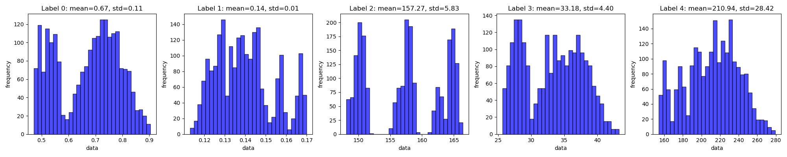
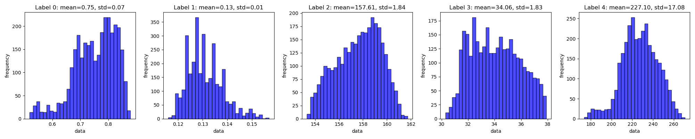
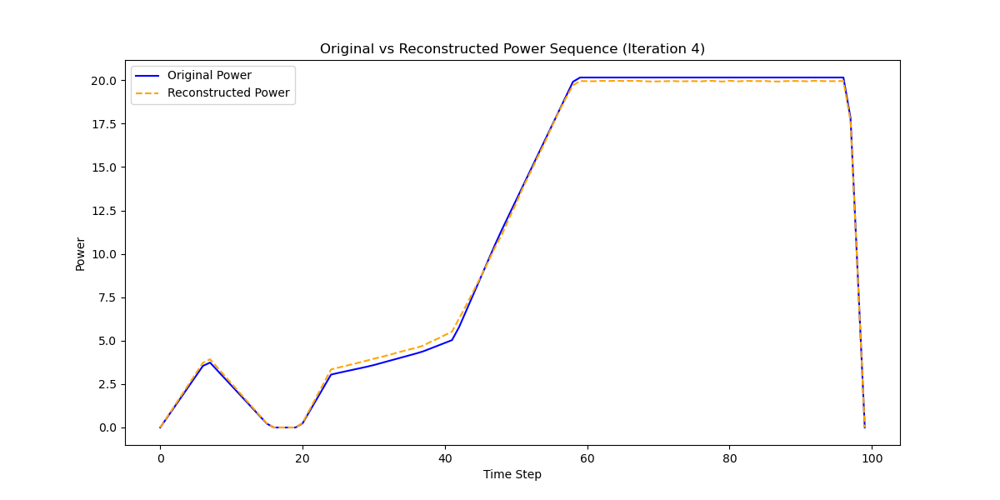
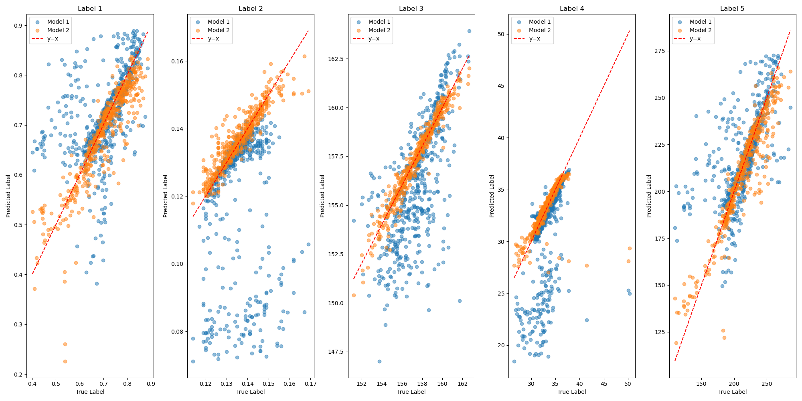

# Introduction

Decoder4ICF is used to generate high-quality multi dataset for Encoder Traning.

Since ICF enquires laser pulse design, which always has a high dimension near 100, it is hard to generate a large dataset with uniform sampling in every DoF because of the exponential growth of the dataset size.

In that case, we can use the decoder to generate the dataset with a uniform distribution in the feature space, which is much easier to sample. The dataset generated by the decoder enables higher efficiency in training the encoder, because:

- **More Uniform**: Avoide the exponential growth of the dataset size, which means we can generate more data in one DoF and enable the encoder to become more accurate.
- **Uniform in feature space**: Compared with the uniform sampling in the dataset space, the uniform sampling in the feature space is more important for the encoder training. This is because the feature space has more physical significance than the dataset space, and the encoder is trained to learn the feature space mapping from the dataset space.

Decoder4ICF also has some amazing benefits:

- **Physical Significance**: Every feature in the feature space has a physical meaning, which corresponds to the laser pulse design. Decoder4ICF can guide the design of the laser pulse *qualitatively* to some extent.
- **Optimal Design**: Since Decoder4ICF can guide the design of the laser pulse, we can use it to find the optimal design *qualitatively* of the laser pulse near the dataset space. 

However, the decoder is not perfect, and it has some limitations:

- **Multiplicity of Solution**: Since the decoder is not a one-to-one mapping, there may be multiple solutions for one feature in the feature space. We can only solve this issue by learning the neighborhood of the feature in the feature space.
- **Coupling of different features**: Some features in the feature space may be coupled, which means changing one feature may affect the other features. We can only solve this issue by learning the decoupling feature in the feature space.

# Working Flow

1. **Train the Decoder**: Prepare the original dataset and train the decoder to learn the mapping from the feature space to the dataset space.
2. **Generate the Uniform Features**: Use the trained decoder to generate the dataset with a uniform distribution in the feature space.
3. **Use Decoder to Generate Laser Pulse**: Use the Decoder to generate the laser pulse with the uniform features.
4. **Use Multi to Calculate Features**: Use the Multi to calculate the features of the generated laser pulse. The features are more accurate than the features predicted by the decoder.
5. **Use Combined Dataset to Train Decoder**: Use the combined dataset to train the decoder to learn the neighborhood of the feature in the feature space. This step can make Decoder more clever with more uniform data, thus generating more accurate laser pulse.

Such one Loop is called a **Decoder4ICF Loop**. Relavant code is in `ReinforceLearning_new.py`.

# File Structure

- `./ReinforceLearning_new.py`: The main code for the Decoder4ICF Loop.
- `./feature_ana/feature_ana.py`: The code for the analysis of the physical significance embedded in the decoder.
- `./Original_Sample/1D_database_final.py` and `./Original_Sample/read_1D_fit.py`: The code for sampling in the dataset space.
- `./Encoder/Encoder.py`: The code for training the encoder.
- `./decoder_model/decoder_model_{index}.pth`: Model pth files for the decoder in the $index^{th}$ Loop.
- `./data_distribution/data_distribution_{index}.png`: Data distribution for the generated data in the $index^{th}$ Loop.
- `./pymulti`: Relevant code for the Multi calculation. You can visit [here](https://github.com/xuxu20040407/PyMulti) for more information.

# Result

## The Dataset is more uniform in the feature space.

Original Dataset:

New Dataset after 1 Decoder4ICF Loop:

It's most impressive in the third feature called "Implosion Velocity" which is tightly related to the platform energy. The original dataset has a large gap in the feature space due to the several sampling on this dimension.

There are some spikes in the histogram of the new dataset, which is caused by the Numerical precision of Multi calculation.

## Physical Significance Embedded in the Decoder

Relavant code is in `feature_ana.py`.

## Higher Presicion of the Decoder

Decoder after 1 Decoder4ICF Loop:

Decoder after 5 Decoder4ICF Loops:

## Higher Presicion of the Encoder

**Model 1** is trained with the original dataset, and **Model 2** is trained with the combined dataset after 5 Decoder4ICF Loops.

Although the loss of Model 1 is lower than Model 2, Model 2 behaves better in the test dataset, which means higher generalization ability.