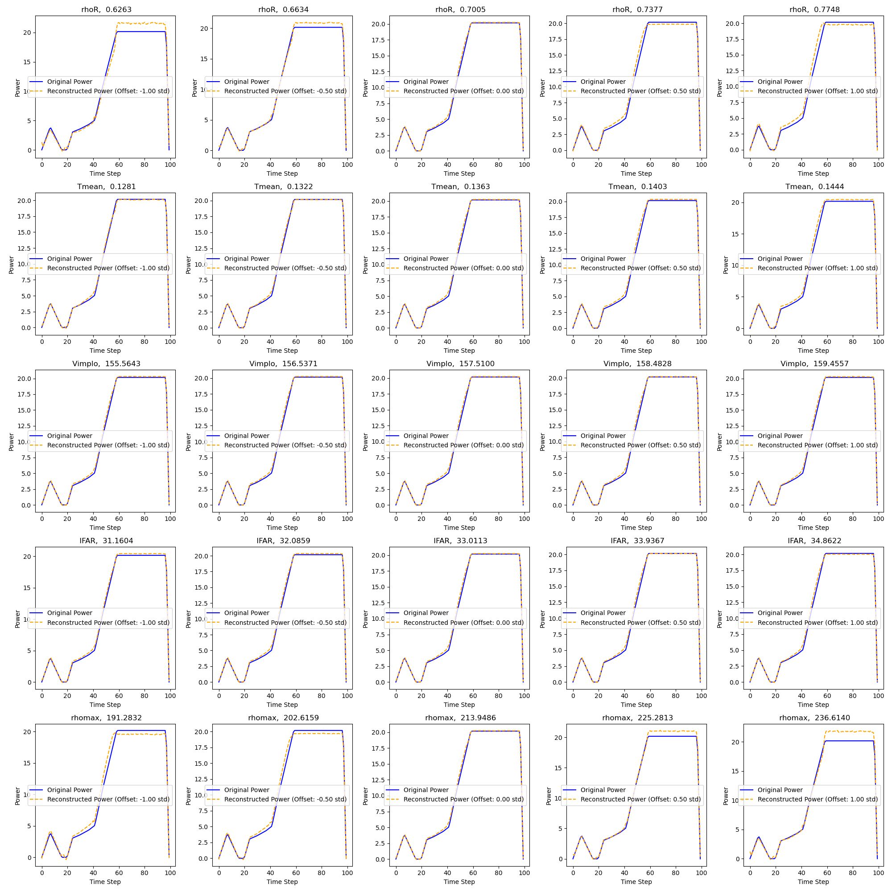

# Introduction
**Decoder4ICF** 用于为编码器训练生成高质量的多数据集。

由于 ICF 需要激光脉冲设计，其维度通常接近 100，因此很难通过在每个自由度（DoF）中进行均匀采样来生成大型数据集，因为数据集大小会呈指数增长。

在这种情况下，我们可以使用解码器在特征空间中生成具有均匀分布的数据集，这比在数据空间中均匀采样更容易。解码器生成的数据集能够提高编码器训练的效率，原因如下：

- **更均匀**：避免数据集大小的指数增长，这意味着我们可以在一个自由度中生成更多数据，从而使编码器更加准确。
- **特征空间中的均匀性**：与在数据空间中均匀采样相比，特征空间中的均匀采样对编码器训练更为重要。这是因为特征空间比数据空间更具物理意义，而编码器是通过学习数据空间到特征空间的映射来进行训练的。

Decoder4ICF 还具有以下显著优势：

- **物理意义**：特征空间中的每个特征都有物理意义，对应于激光脉冲设计。Decoder4ICF 可以在一定程度上定性地指导激光脉冲的设计。
- **最优设计**：由于 Decoder4ICF 可以指导激光脉冲的设计，我们可以利用它在数据空间附近找到激光脉冲的定性最优设计。

然而，解码器并不完美，它存在一些限制：

- **解的多重性**：由于解码器不是一一映射，特征空间中的一个特征可能有多种解决方案。我们只能通过学习特征空间中特征的邻域来解决这一问题。
- **不同特征之间的耦合**：特征空间中的一些特征可能相互耦合，这意味着改变一个特征可能会影响其他特征。我们只能通过学习特征空间中的解耦特征来解决这一问题。

# Working Flow
1. 训练解码器：准备原始数据集，并训练解码器学习从特征空间到数据空间的映射。
2. 生成均匀特征：使用训练好的解码器生成在特征空间中具有均匀分布的数据集。
3. 使用解码器生成激光脉冲：使用解码器根据均匀特征生成激光脉冲。
4. 使用 Multi 计算特征：使用 Multi 计算生成的激光脉冲的特征。这些特征比解码器预测的特征更准确。
5. 使用组合数据集训练解码器：使用组合数据集训练解码器，使其学习特征空间中特征的邻域。这一步可以使解码器更聪明，生成更均匀的数据，从而生成更准确的激光脉冲。

这样一个循环称为一个 **Decoder4ICF 循环**。相关代码位于`ReinforceLearning_new.py`。

# Result
## 数据集在特征空间中更均匀
原始数据集：

经过 1 次 Decoder4ICF 循环后的数据集：

在与平台能量密切相关且对实验影响较大的第三个特征“内爆速度”上，改进最为明显。原始数据集在该维度上由于采样点较少，导致特征空间存在较大缺口。

新数据集的直方图中存在一些尖峰，这是由 **Multi** 计算的数值精度引起的。

## 解码器嵌入的物理意义

相关代码位于`feature_ana.py`。

## 解码器精度更高

经过 1 次 Decoder4ICF 循环后的解码器：

经过 5 次 Decoder4ICF 循环后的解码器：

## 编码器精度更高

这是用不同数据集训练的 4 个模型--网格采样、拉丁超立方采样、自编码器和物理信息嵌入编码器。它们采用相同的超参数和相同的训练过程进行训练。这意味着模型性能的差异只是由数据集的质量造成的。

虽然**PID**模型的损失高于其他模型，但它在验证数据集中的表现更好，这意味着更高的泛化能力。

# Update

- 2025.04.06: 重新写了代码，使其更加模块化；
- 2025.04.21: 添加了 AE 循环的代码；